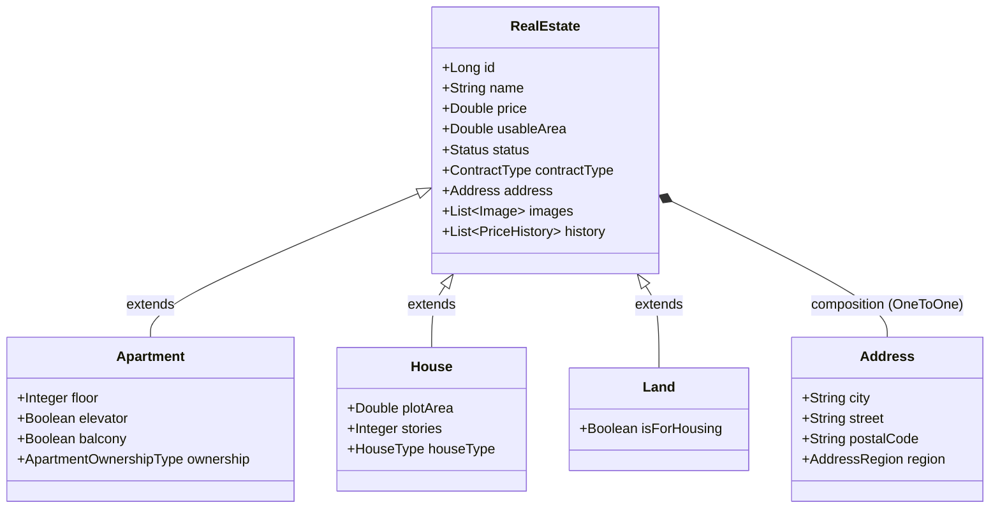
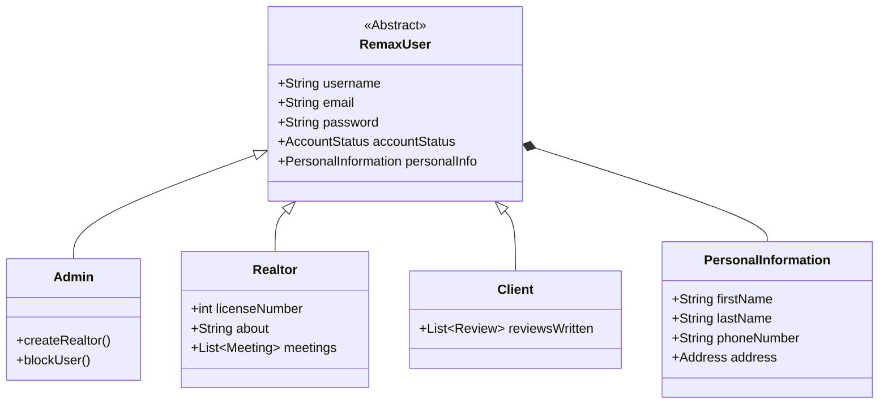
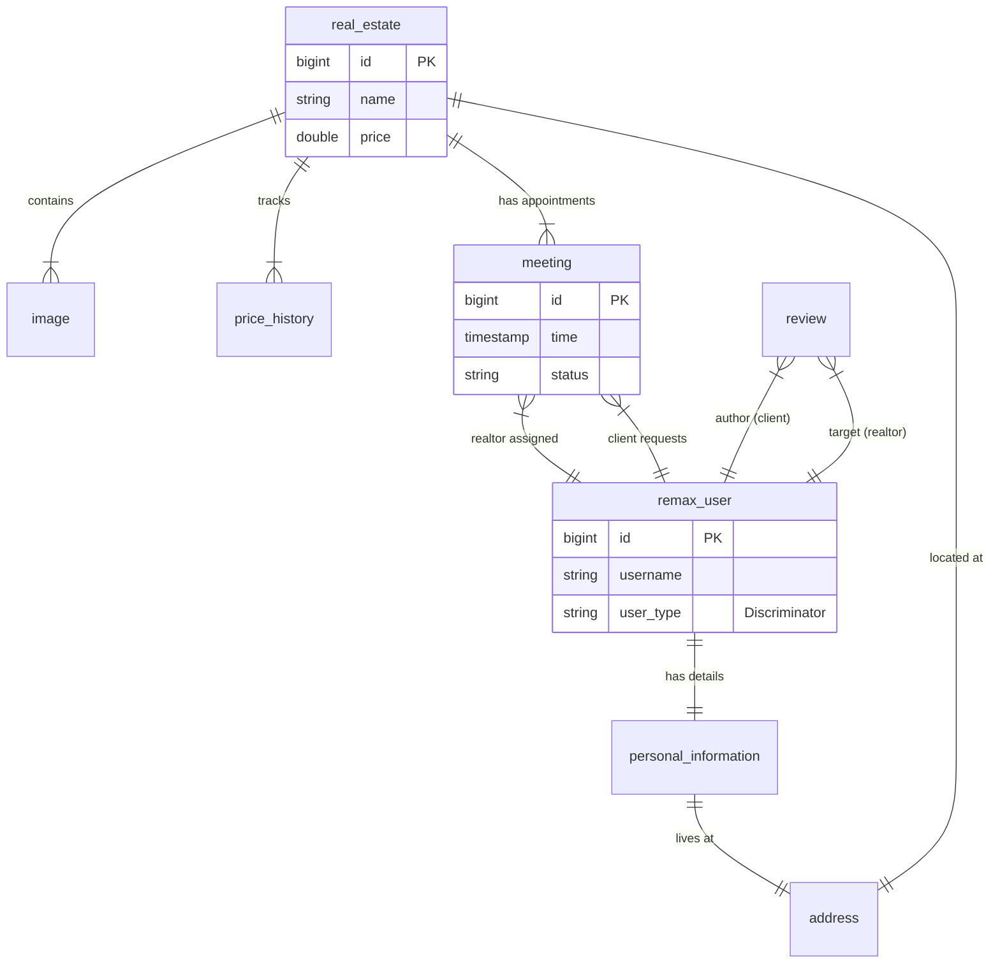
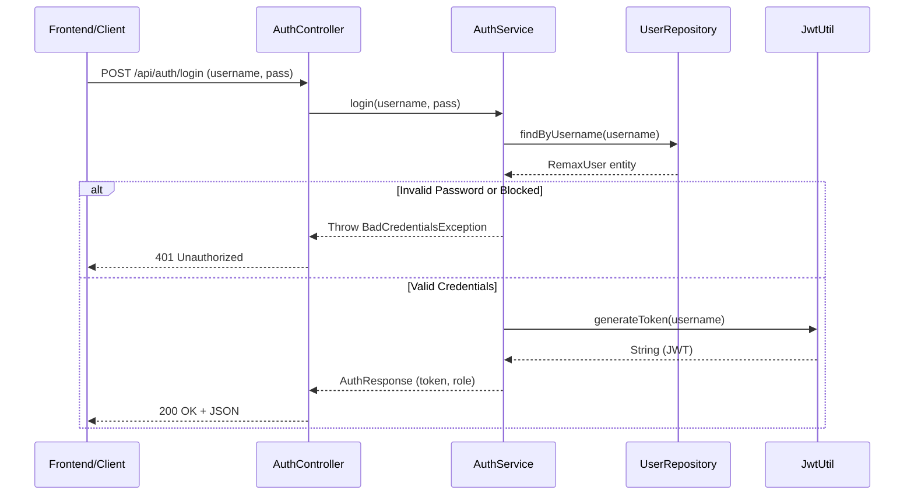
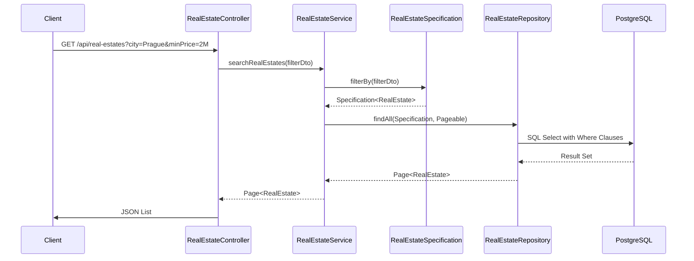
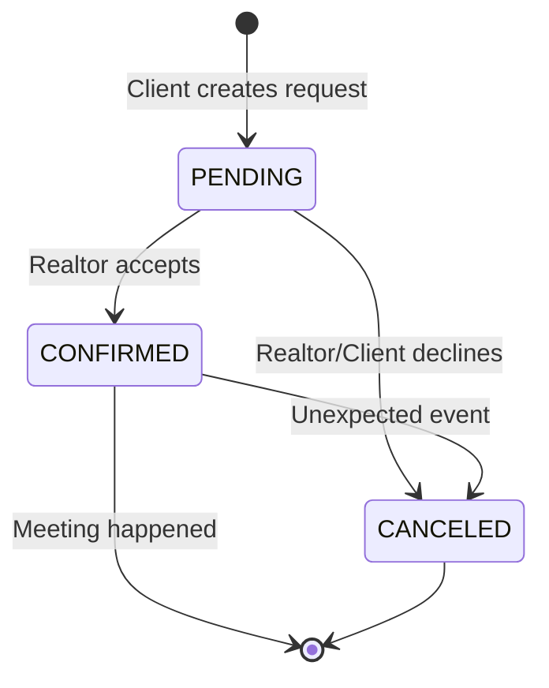
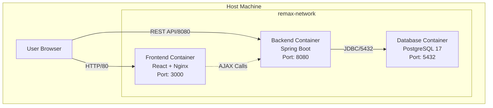

### 13. UML Diagrams (Architektura a Design)

Tato sekce vizualizuje klíčové struktury a toky v aplikaci pomocí UML diagramů.

#### 13.1 Class Diagram - Domain Model (Nemovitosti)
Diagram znázorňuje polymorfismus u entit nemovitostí (`RealEstate`) využívající strategii `JOINED` inheritance.

#### 13.2 Class Diagram - User Hierarchy (Uživatelé)
Systém rolí je řešen dědičností `SINGLE_TABLE`.

---

### New Section: 14. Entity-Relationship Diagram (ERD)

Schéma databáze generované na základě JPA entit. Zvýrazňuje vztahy mezi tabulkami a cizí klíče.

---

### New Section: 15. Sequence Diagrams (Toky Aplikace)

#### 15.1 Authentication Flow (Login)
Ukázka procesu přihlášení, validace a vydání JWT tokenu.

#### 15.2 Real Estate Filtering Flow
Ukázka dynamického filtrování pomocí JPA Specification.

---

### New Section: 16. State Machine Diagrams (Stavové diagramy)

#### 16.1 Meeting Lifecycle
Stavový diagram pro entitu `Meeting` (`PENDING`, `CONFIRMED`, `CANCELED`).

---

### New Section: 17. Deployment Architecture

Vizualizace nasazení pomocí Docker Compose.

---
