# Architektura a Design Systému (NNPRO-REMAX)

Tento dokument slouží jako vizuální a architektonická příloha k technické dokumentaci backendu. Zaměřuje se na strukturální rozvržení (UML Class a ERD diagramy), behaviorální modely (sekvenční diagramy, toky aktivit) a fyzickou infrastrukturu nasazení.

> 📘 **Hlavní dokumentace:** Textový popis technologií, instalace a API naleznete v souboru [Technical_documentation.md](./Technical_documentation.md).

## Obsah

**Technická Příručka (Externí):**
1. [Úvod a Technologie](./Technical_documentation.md#1-úvod-a-technologie)
2. [Architektura a Struktura Kódu](./Technical_documentation.md#2-architektura-a-struktura-kódu)
3. [Datová Vrstva a Migrace](./Technical_documentation.md#3-datová-vrstva-a-migrace)
4. [Zabezpečení (Security)](./Technical_documentation.md#4-zabezpečení-security)
5. [REST API a Kontrolery](./Technical_documentation.md#5-rest-api-a-kontrolery)
6. [Klíčové Funkcionality](./Technical_documentation.md#6-klíčové-funkcionality)
7. [Testování a Kvalita Kódu](./Technical_documentation.md#7-testování-a-kvalita-kódu)
8. [Instalace, Docker a Spuštění](./Technical_documentation.md#8-instalace-docker-a-spuštění)

**Architektura a Design (Tento dokument):**
9. [Strukturální pohled (Structural View)](#9-strukturální-pohled-structural-view)
10. [Behaviorální pohled (Behavioral View)](#10-behaviorální-pohled-behavioral-view)
11. [Infrastruktura a Nasazení (Deployment)](#11-infrastruktura-a-nasazení-deployment)

---
---

## 9. Strukturální pohled (Structural View)

Tato kapitola definuje statickou stavbu systému – od databázového schématu přes objektový model až po rozdělení do logických komponent.

### 9.1 Entity-Relationship Diagram (ERD)
Schéma databáze odpovídající `Liquibase` changelogům. Znázorňuje fyzické uložení dat.
*   **Inheritance (RealEstate):** Strategie `JOINED` (tabulky `real_estate`, `apartment`, `house`, `land`).
*   **Inheritance (User):** Strategie `SINGLE_TABLE` (tabulka `remax_user` s diskriminátorem).

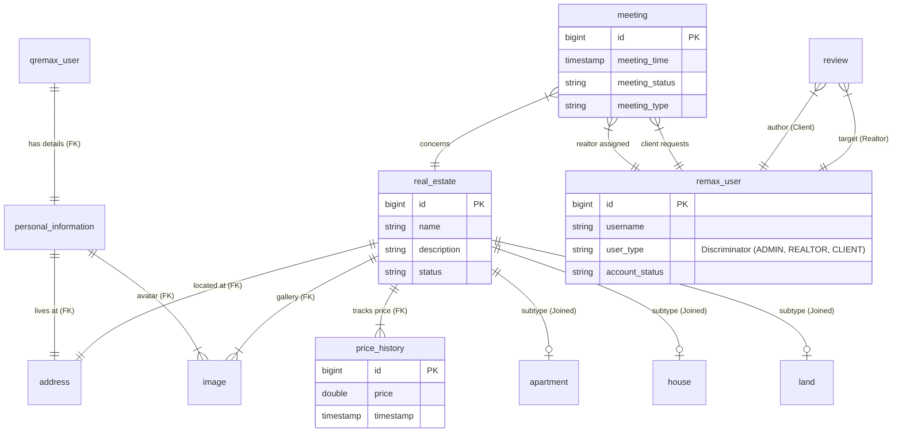

### 9.2 Class Diagram - Domain Model (Nemovitosti)
Diagram znázorňuje ORM mapování a polymorfismus u entit nemovitostí (`RealEstate`)  využívající strategii `JOINED` inheritance. Společná data jsou v abstraktní třídě, specifická v podtřídách. Cena je řešena historií vývoje (`PriceHistory`).

### 9.3 Class Diagram - User Hierarchy (Uživatelé)
Systém rolí je řešen dědičností `SINGLE_TABLE`. Osobní údaje jsou odděleny do entity `PersonalInformation` pro lepší modularitu a dodržování principu Separation of Concerns.

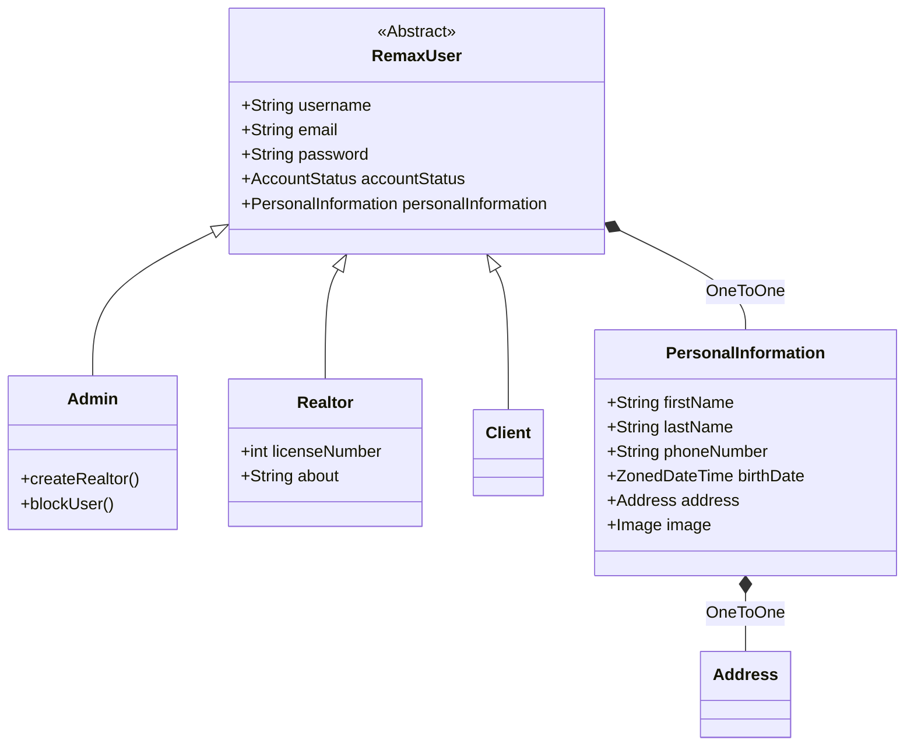

### 9.4 Component Diagram (Logická Architektura)
Aplikace je navržena jako **modulární monolit**. Diagram ukazuje závislosti mezi jednotlivými balíčky (features), které komunikují primárně skrze Service vrstvy.

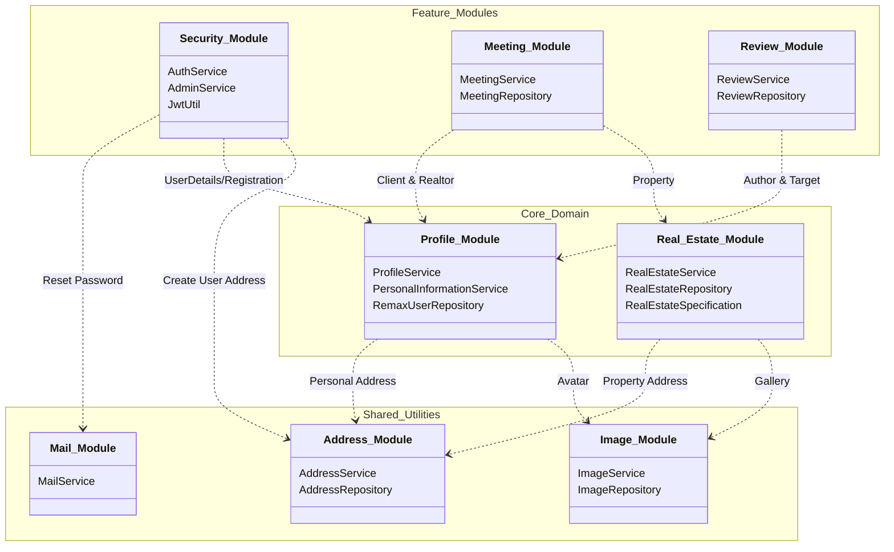

---

## 10. Behaviorální pohled (Behavioral View)

Tato sekce popisuje dynamické chování systému, interakce uživatelů a toky dat.

### 10.1 Use Case Diagrams (Případy užití)
Diagramy vycházejí z nastavení `SecurityConfig` a anotací `@PreAuthorize`.

#### 10.1.1 Veřejnost a Klienti
Neregistrovaný uživatel (Guest) má přístup pouze k prohlížení a registraci.
Klient (`ROLE_USER`) má po přihlášení přístup k interakcím s makléři.
*   **Klíčová funkce:** Klient vidí statistiky makléřů (hodnocení), což mu pomáhá při výběru.

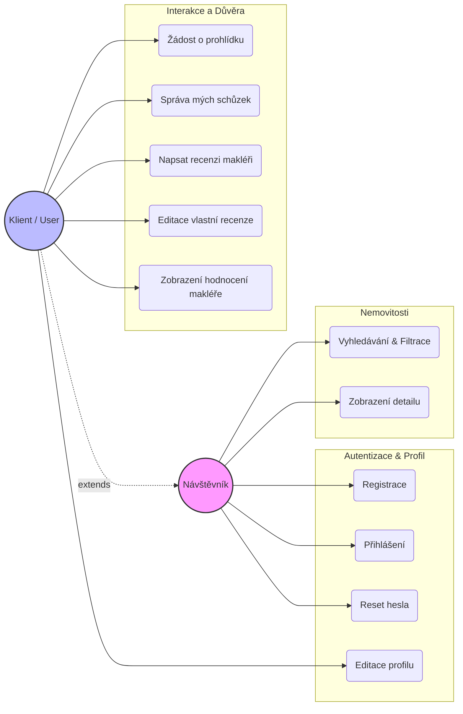

#### 10.1.2 Makléři a Administrátoři
Makléř (`ROLE_REALTOR`) spravuje portfolio a schůzky. Admin (`ROLE_ADMIN`) zajišťuje technickou správu a moderaci.

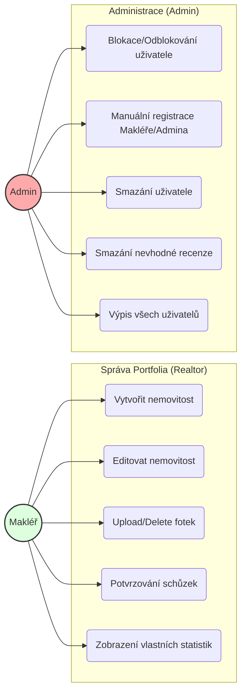

### 10.2 Sequence Diagrams (Sekvenční diagramy)
Zachycují časový průběh komunikace mezi komponentami pro "Happy Path" scénáře.

#### 10.2.1 Authentication Flow
Přihlášení uživatele, ověření blokace a vydání JWT tokenu.
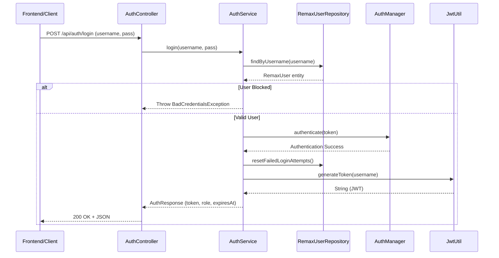

#### 10.2.2 Real Estate Filtering Flow
Dynamické filtrování pomocí JPA Specification a Criteria API.
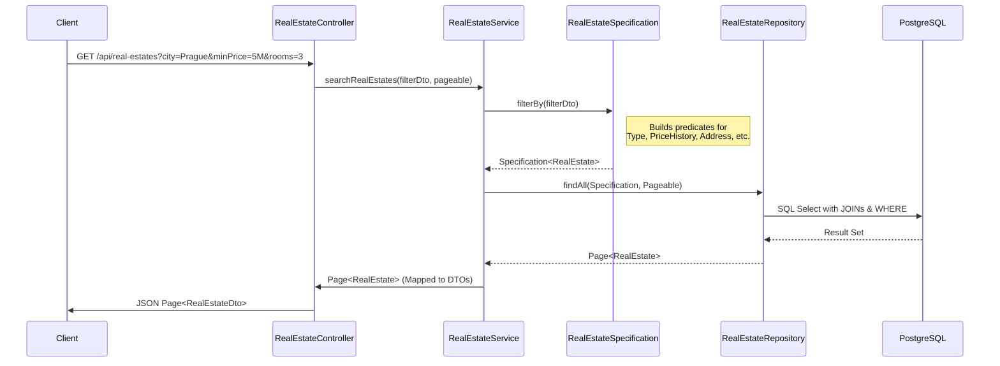

### 10.3 Activity Diagrams (Diagramy Aktivit)
Detailní popis algoritmů s rozhodovací logikou.

#### 10.3.1 Login & Brute-force Protection
Logika v `AuthService` chránící účet před hádáním hesel.
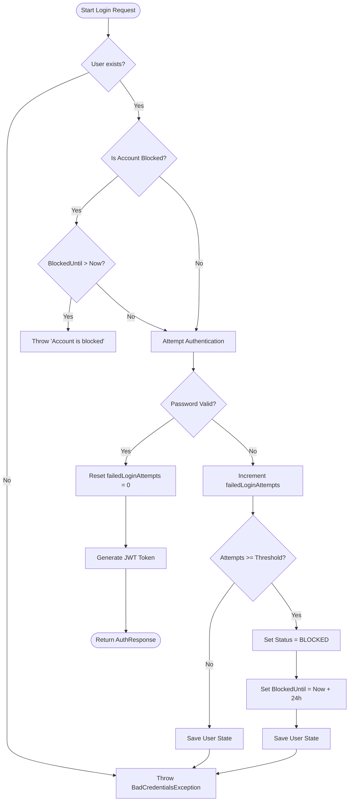

#### 10.3.2 Real Estate Update & Price History
Logika v `RealEstateService` zajišťující verzování ceny a polymorfní update.
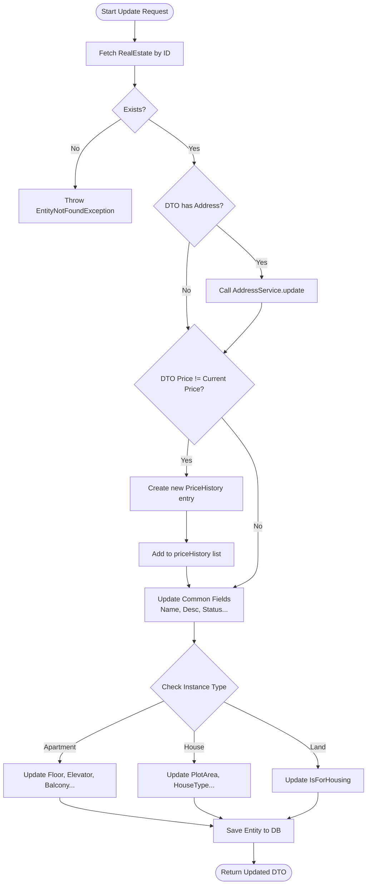

#### 10.3.3 Password Reset Lifecycle
Tento diagram zachycuje dvoufázový proces obnovy hesla.
1.  **Žádost:** Generování unikátního kódu, jeho hashování pro databázi a odeslání v čitelné podobě e-mailem.
2.  **Potvrzení:** Validace přijatého kódu, kontrola expirační lhůty a samotná změna hesla.
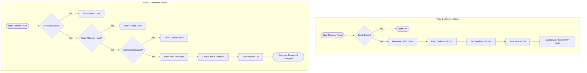

#### 10.3.4 Meeting Creation Validation
Diagram vizualizuje logiku v `MeetingService.createMeeting`. Důraz je kladen na **validaci cizích klíčů** a **kontrolu typů uživatelů** (instanceof check), aby bylo zajištěno, že schůzka propojuje skutečnou nemovitost, makléře a klienta.

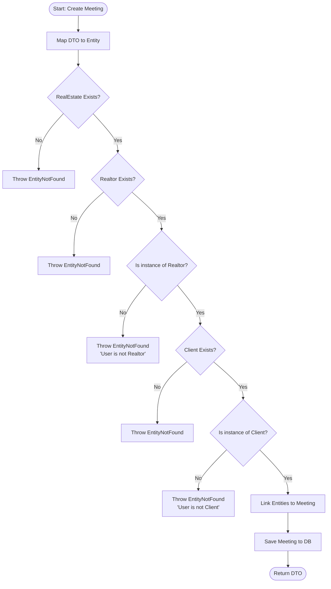

#### 10.3.5 Review Creation Logic
Byznys pravidlo: Pouze Klient může hodnotit Makléře.
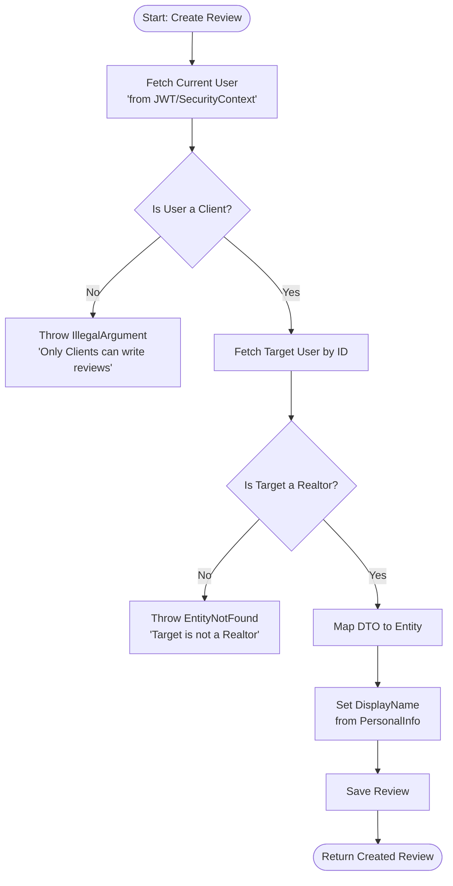

### 10.4 State Machine Diagram (Stavové diagramy)
Životní cyklus schůzky (`Meeting`) v systému.

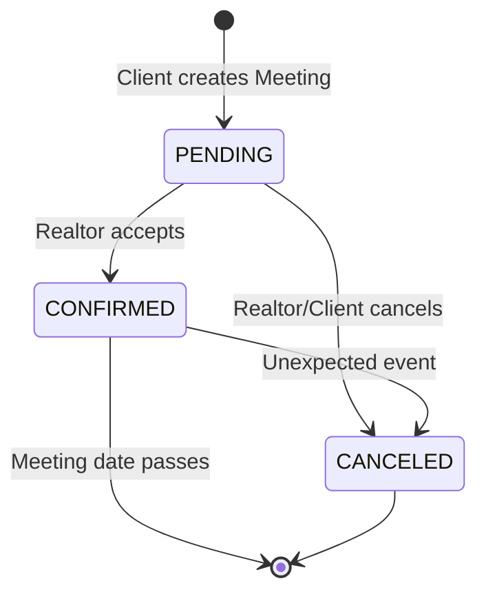

---

## 11. Infrastruktura a Nasazení (Deployment)

### 11.1 Deployment Architecture
Vizualizace kontejnerizace aplikace definované v `docker-compose.yml`. Ukazuje izolaci sítě a mapování portů.

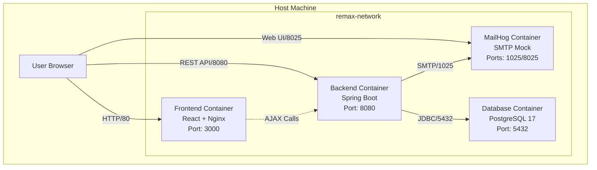