### 13. UML Diagrams (Architektura a Design)

Tato sekce vizualizuje klíčové struktury a toky v aplikaci pomocí UML diagramů.

#### 13.1 Class Diagram - Domain Model (Nemovitosti)
Diagram znázorňuje polymorfismus u entit nemovitostí (`RealEstate`) využívající strategii `JOINED` inheritance. Společná data jsou v abstraktní třídě, specifická v podtřídách. Cena je řešena historií vývoje (`PriceHistory`).

#### 13.2 Class Diagram - User Hierarchy (Uživatelé)
Systém rolí je řešen dědičností `SINGLE_TABLE`. Osobní údaje jsou odděleny do entity `PersonalInformation` pro lepší modularitu.

```mermaid
classDiagram
    class RemaxUser {
        <<Abstract>>
        +String username
        +String email
        +String password
        +AccountStatus accountStatus
        +PersonalInformation personalInformation
    }

    class Admin {
        +createRealtor()
        +blockUser()
    }

    class Realtor {
        +int licenseNumber
        +String about
    }

    class Client {

    }

    class PersonalInformation {
        +String firstName
        +String lastName
        +String phoneNumber
        +ZonedDateTime birthDate
        +Address address
        +Image image
    }

    RemaxUser <|-- Admin
    RemaxUser <|-- Realtor
    RemaxUser <|-- Client
    RemaxUser *-- PersonalInformation : OneToOne
    PersonalInformation *-- Address : OneToOne
```

---

### 14. Entity-Relationship Diagram (ERD)

Schéma databáze odpovídající `Liquibase` changelogům.
- **Inheritance (RealEstate):** JOINED (tabulky `real_estate`, `apartment`, `house`, `land`).
- **Inheritance (User):** SINGLE_TABLE (pouze tabulka `remax_user` s diskriminátorem `user_type`).
- 

---

### 15. Sequence Diagrams (Toky Aplikace)

#### 15.1 Authentication Flow (Login)
Proces přihlášení, validace účtu (zda není blokován) a vydání JWT tokenu.

#### 15.2 Real Estate Filtering Flow
Ukázka dynamického filtrování pomocí `RealEstateSpecification` a JPA Criteria API.

---

### 16. State Machine Diagrams (Stavové diagramy)

#### 16.1 Meeting Lifecycle
Životní cyklus schůzky řízený přes `MeetingService`.

---

### 17. Deployment Architecture

Vizualizace nasazení definovaná v `docker-compose.yml`.

---
