### 13. UML Diagrams (Architektura a Design)

Tato sekce vizualizuje klíčové struktury a toky v aplikaci pomocí UML diagramů.

#### 13.1 Class Diagram - Domain Model (Nemovitosti)
Diagram znázorňuje polymorfismus u entit nemovitostí (`RealEstate`) využívající strategii `JOINED` inheritance. Společná data jsou v abstraktní třídě, specifická v podtřídách. Cena je řešena historií vývoje (`PriceHistory`).

#### 13.2 Class Diagram - User Hierarchy (Uživatelé)
Systém rolí je řešen dědičností `SINGLE_TABLE`. Osobní údaje jsou odděleny do entity `PersonalInformation` pro lepší modularitu.

### 13.3 Use Case Diagrams (Případy užití)

Tato sekce definuje, jaké akce mohou jednotliví aktéři v systému provádět. Diagramy vycházejí z nastavení `SecurityConfig` a anotací `@PreAuthorize` v kontrolerech.

#### 13.3.1 Public & Client Actors (Veřejnost a Klienti)
Neregistrovaný uživatel (Guest) má přístup pouze k prohlížení a registraci. Po přihlášení získává Klient (`ROLE_USER`) možnost interagovat se systémem.

**Důležité:** Klient má přístup ke **statistikám makléře** (hodnocení), což je klíčové pro rozhodování, kterého makléře oslovit.

```mermaid
graph LR
    %% Actors
    Guest((Návštěvník))
    Client((Klient / User))

    %% Use Cases
    subgraph "Autentizace & Profil"
        UC_Reg(Registrace)
        UC_Log(Přihlášení)
        UC_Reset(Reset hesla)
        UC_Profile(Editace profilu)
    end

    subgraph "Nemovitosti"
        UC_Search(Vyhledávání & Filtrace)
        UC_Detail(Zobrazení detailu)
    end

    subgraph "Interakce a Důvěra"
        UC_ReqMeet(Žádost o prohlídku)
        UC_MyMeet(Správa mých schůzek)
        UC_Review(Napsat recenzi makléři)
        UC_EditReview(Editace vlastní recenze)
        UC_Stats(Zobrazení hodnocení makléře)
    end

    %% Relations Guest
    Guest --> UC_Search
    Guest --> UC_Detail
    Guest --> UC_Reg
    Guest --> UC_Log
    Guest --> UC_Reset

    %% Relations Client
    Client -.->|extends| Guest
    Client --> UC_Profile
    Client --> UC_ReqMeet
    Client --> UC_MyMeet
    Client --> UC_Review
    Client --> UC_EditReview
    Client --> UC_Stats

    style Guest fill:#f9f,stroke:#333,stroke-width:2px
    style Client fill:#bbf,stroke:#333,stroke-width:2px
```

#### 13.3.2 Management Actors (Makléři a Administrátoři)
Makléř (`ROLE_REALTOR`) spravuje své portfolio. Statistiky (UC_Stats) vidí také, ale v kontextu zpětné vazby na svou vlastní práci. Administrátor (`ROLE_ADMIN`) zajišťuje technickou správu.

**Vysvětlení oprávnění:**
*   **Klient:** Může editovat pouze své vlastní údaje a recenze. Statistiky makléřů (`GET /api/reviews/stats/{id}`) jsou přístupné všem přihlášeným uživatelům.
*   **Makléř:** Má právo manipulovat s entitami `RealEstate`, `Image` a potvrzovat schůzky.
*   **Admin:** Má nejvyšší oprávnění pro správu účtů, včetně blokování uživatelů a mazání recenzí (moderace), ale standardně nezasahuje do obchodních dat nemovitostí.
---

### 14. Entity-Relationship Diagram (ERD)

Schéma databáze odpovídající `Liquibase` changelogům.
- **Inheritance (RealEstate):** JOINED (tabulky `real_estate`, `apartment`, `house`, `land`).
- **Inheritance (User):** SINGLE_TABLE (pouze tabulka `remax_user` s diskriminátorem `user_type`).
- 

---

### 15. Sequence Diagrams (Toky Aplikace)

#### 15.1 Authentication Flow (Login)
Proces přihlášení, validace účtu (zda není blokován) a vydání JWT tokenu.

#### 15.2 Real Estate Filtering Flow
Ukázka dynamického filtrování pomocí `RealEstateSpecification` a JPA Criteria API.

---

### 16. State Machine Diagrams (Stavové diagramy)

#### 16.1 Meeting Lifecycle
Životní cyklus schůzky řízený přes `MeetingService`.

---

### 17. Deployment Architecture

Vizualizace nasazení definovaná v `docker-compose.yml`.

---
